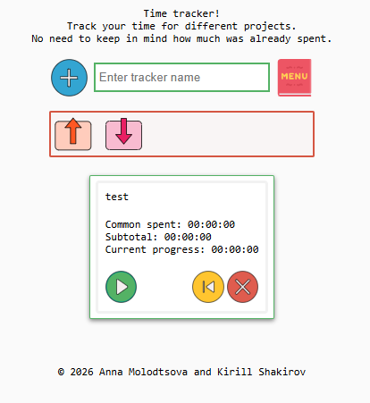
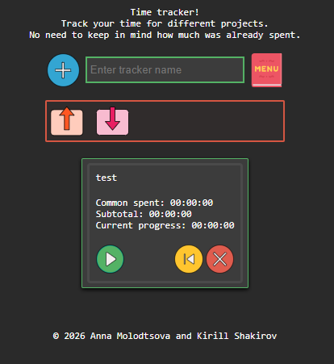

# timetracker_extention

## Short description

Extention that allows to track time spent for certain projects. No need to keep in mind how much time was already spent for the previous session.

## Detailed description

Click "Time Tracker" button on your browser navigation panel to open new tab with extension. Provide name for your tracker and click
"Add tracker" button. New card with tracker will appear on the page. Click "Start" once you start the work and "Pause" once you stop working.
Time calculated next to "Current progress" field will be noted and value next to the "Common spent" field will be updated.
To remove tracker click button "Remove".

Github URL: https://github.com/annamolodtsova/timetracker_extension
AMO URL: https://addons.mozilla.org/en-US/firefox/addon/timetracker_extension/

Project is licensed under the GPL v3 or later. See LICENSE.txt for details.

Donations:
(BTC) `bc1q8wntnwp7gvzsja2gyz3v54dl0rtw8dvurr9adn` (Bitcoin BIP84)
(LTC) `ltc1qekz29886ygxrsaltqzhqxum5v0a7hznxj5f8cf` (Litecoin BIP84)
(XMR) `82oWmSEmMAvKd5sR8Ein9DCf8PumADAPxZcqUpTJHimpfiFVhbC6jfGSStrMhKhFGU57PdZmoMK7mAgZw6Rx3frXESqRZDh` (Monero)
(BNB) `0x98699c93856149C452c0e656Ff3266a0CC25D71a` (BNB Smart Chain)
(TON) `UQBwH1wo6WGnFg87SUZPXM2cLg_xzGBXonI8EJgbpu75kBVT` (The Open Network)

Contributors:
[annamolodtsova](https://github.com/annamolodtsova)
[Nyanraltotlapun](https://github.com/Nyanraltotlapun)
[Tsenzuk](https://github.com/Tsenzuk)

